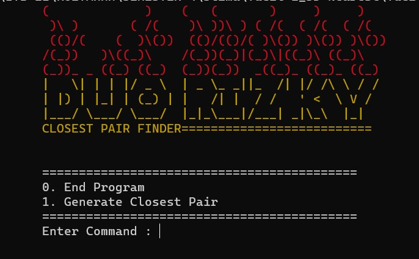
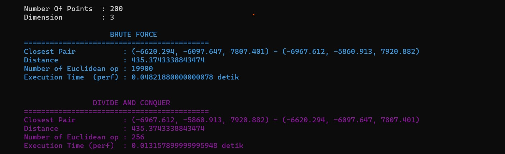
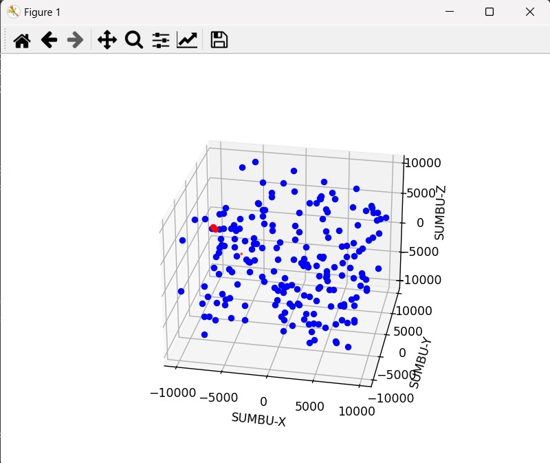

# Closest Pair Finder

> Composed to fulfill Tucil 2 IF2211 Strategi Algoritma

## Program Description

This program is used for find closest pair from random points generated. Program retrieve number of random points to generate and number of dimension of its points from users. Technically program use `Divide and Conquer` algorithm to find the closest pair, but program use `Brute-Force` algorithm as well as a benchmark. Program use two factor to compare the efficiency of the algorithm: Execution time and number of euclidean operation operated. If number of dimension inputed is lower or equal by three, program can visualize the scattering diagram as well.

## Brute-Force vs Divide-and-Conquer

## Visualizer

## Program Structure
* [bin/](.\Tucil2_13521109-13521119\bin)
  * [.gitignore](.\Tucil2_13521109-13521119\bin\.gitignore)
* [doc/](.\Tucil2_13521109-13521119\doc)
* [src/](.\Tucil2_13521109-13521119\src)
  * [__pycache__/](.\Tucil2_13521109-13521119\src\__pycache__)
    * [bruteForce.cpython-39.pyc](.\Tucil2_13521109-13521119\src\__pycache__\bruteForce.cpython-39.pyc)
    * [dataType.cpython-39.pyc](.\Tucil2_13521109-13521119\src\__pycache__\dataType.cpython-39.pyc)
    * [divideConquer.cpython-39.pyc](.\Tucil2_13521109-13521119\src\__pycache__\divideConquer.cpython-39.pyc)
    * [IO.cpython-39.pyc](.\Tucil2_13521109-13521119\src\__pycache__\IO.cpython-39.pyc)
    * [main.cpython-39.pyc](.\Tucil2_13521109-13521119\src\__pycache__\main.cpython-39.pyc)
    * [visual.cpython-39.pyc](.\Tucil2_13521109-13521119\src\__pycache__\visual.cpython-39.pyc)
  * [3dinterface.py](.\Tucil2_13521109-13521119\src\3dinterface.py)
  * [bruteForce.py](.\Tucil2_13521109-13521119\src\bruteForce.py)
  * [dataType.py](.\Tucil2_13521109-13521119\src\dataType.py)
  * [divideConquer.py](.\Tucil2_13521109-13521119\src\divideConquer.py)
  * [GUI.py](.\Tucil2_13521109-13521119\src\GUI.py)
  * [IO.py](.\Tucil2_13521109-13521119\src\IO.py)
  * [main.py](.\Tucil2_13521109-13521119\src\main.py)
  * [threeDimension.py](.\Tucil2_13521109-13521119\src\threeDimension.py)
  * [visual.py](.\Tucil2_13521109-13521119\src\visual.py)
* [test/](.\Tucil2_13521109-13521119\test)
* [README.md](.\Tucil2_13521109-13521119\README.md)

## Requirement

- python3
- matplotlib

## How To Run

1. type `python3 main.py` in `..\Tucil2_13521109-13521119` directory

## Author
| NIM      | Name                   |
| -------- | ---------------------- |
| 13521109 | Rizky Abdillah Rasyid  |
| 13521119 | Muhammad Rizky Sya'ban |
